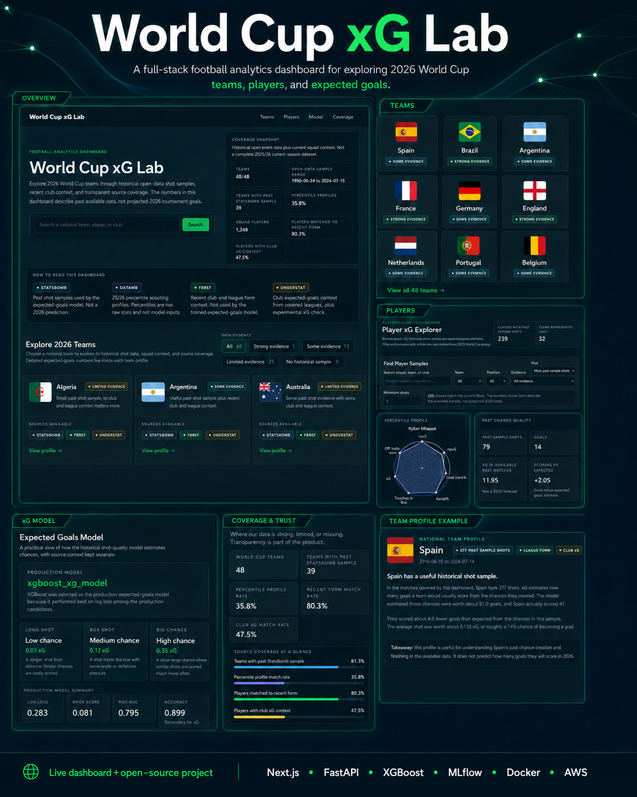
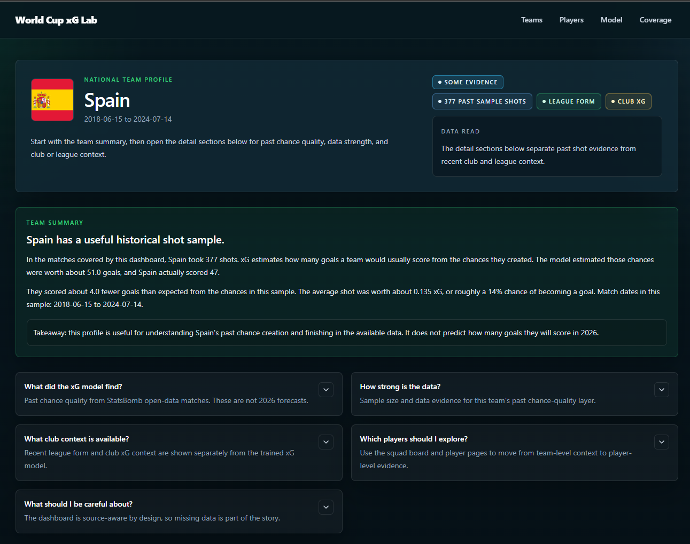
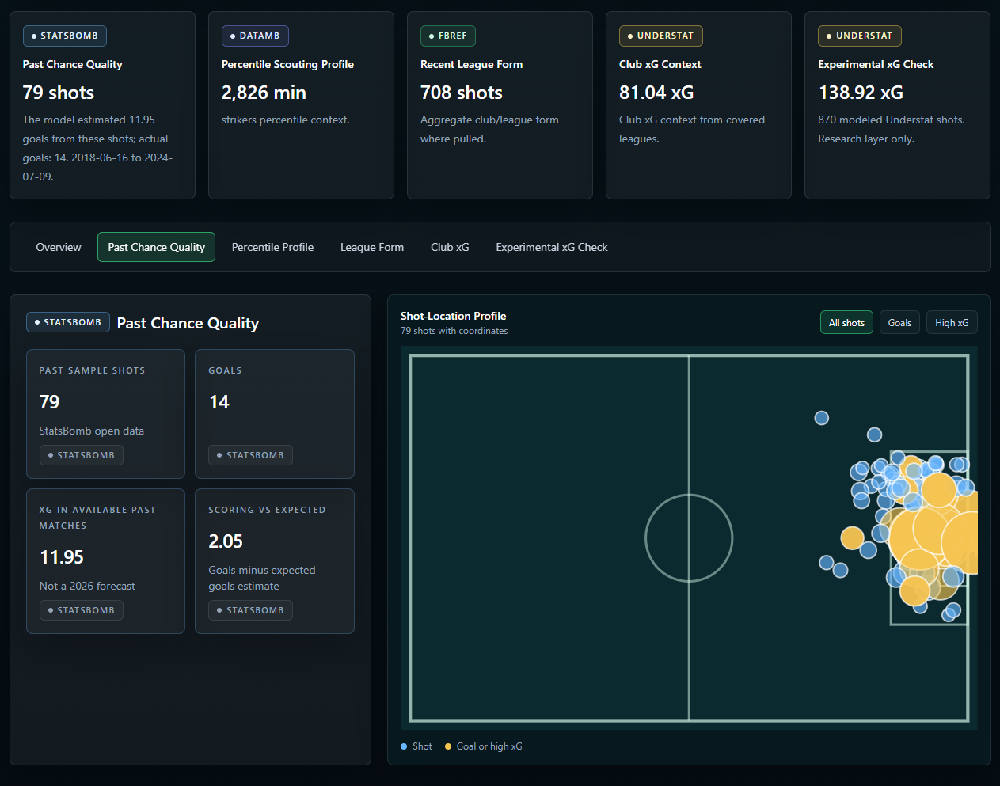
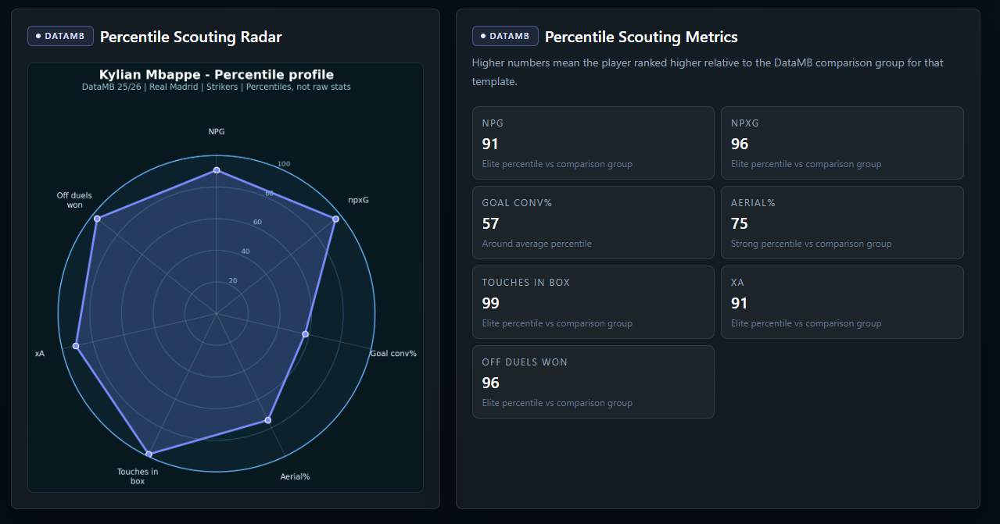
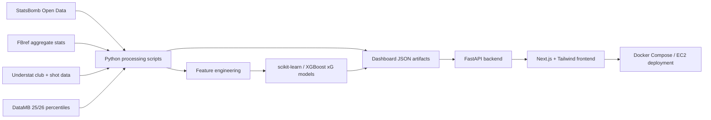

# World Cup xG Lab

World Cup xG Lab is a full-stack football analytics project that helps fans explore how 2026 World Cup teams and players created scoring chances in historical open data, with recent club context layered in where the historical sample is limited.

The project is not a guaranteed 2026 prediction model. It shows historical shot-quality evidence, scoring zones, model xG output, and source-aware context from StatsBomb, FBref, Understat, and DataMB.

## Live Demo

View the deployed dashboard: [https://worldcupxglab.duckdns.org/](https://worldcupxglab.duckdns.org/)

## Demo Screenshots

### Dashboard Overview



### Team And Player Views

| Team profile summary | Player chance-quality view |
|---|---|
|  |  |

### Percentile Scouting Profile



## What The Dashboard Does

- Shows 2026 World Cup teams and confirmed squad players.
- Explains where historical StatsBomb shot samples are strong, limited, or missing.
- Displays team and player xG output from a StatsBomb-trained model.
- Adds recent club/player context from FBref and Understat when historical samples are weak.
- Adds DataMB 25/26 percentile profiles where available.
- Keeps source boundaries visible so users do not mistake historical evidence for 2026 forecasts.

## Production Dashboard Architecture



Runtime architecture:

```text
Nginx reverse proxy
  /        -> Next.js frontend
  /api/*   -> FastAPI backend
  /health  -> FastAPI health endpoint
```

FastAPI serves precomputed JSON artifacts from `data/dashboard_artifacts/`. Models are not retrained at request time.

## Tech Stack

- Python
- pandas, NumPy
- scikit-learn, XGBoost
- MLflow
- FastAPI
- Next.js, TypeScript, Tailwind
- Docker, Docker Compose
- AWS EC2
- StatsBomb Open Data
- FBref
- Understat
- DataMB

Streamlit exists only as an earlier prototype and internal exploration tool. The production-style dashboard is Next.js + FastAPI.

## Data Sources

| Source | Used For | Not Used For |
|---|---|---|
| StatsBomb Open Data | Model training, historical shot-location xG, shot maps, scoring zones | Complete current-season coverage or guaranteed 2026 predictions |
| FBref | Recent aggregate player/squad form context such as minutes, goals, assists, shots, and shooting rates | Replacing the StatsBomb xG model |
| Understat | Club xG context and experimental source-model research | Automatically replacing the production model |
| DataMB | 25/26 percentile scouting context where matched | Raw per-90 model training inputs |

## Model Summary

The production xG layer uses an XGBoost classifier trained on historical StatsBomb shot data.

| Model | Log Loss | Brier Score | ROC-AUC | Accuracy at 0.5 |
|---|---:|---:|---:|---:|
| XGBoost xG model | 0.283 | 0.081 | 0.795 | 0.899 |
| Logistic regression baseline | 0.286 | 0.082 | 0.789 | 0.899 |

XGBoost was selected because it performed best on log loss among the production candidates. For expected goals, log loss and Brier score matter more than raw accuracy because the model is estimating probabilities, not just classifying shots as goals or non-goals.

Features include shot location, distance to goal, angle to goal, body part, shot type, pressure, play pattern, minute, and period.

## Data Coverage

Current dashboard artifact coverage:

- 48 configured 2026 World Cup teams.
- 1,248 confirmed squad-player rows.
- 39 of 48 teams have historical StatsBomb shot samples.
- 9 teams currently have no historical StatsBomb shot sample in the available data: Bosnia and Herzegovina, Cabo Verde, Curacao, Haiti, Iraq, Jordan, New Zealand, Norway, and Uzbekistan.
- FBref matched 1,002 of 1,248 squad players, about 80.3%.
- Understat matched 593 of 1,248 squad players, about 47.5%.
- DataMB matched 447 of 1,248 squad players, about 35.8%.
- Historical open-data sample range: 1958-06-24 to 2024-07-15.

Missing data does not mean a team or player is weak. It means the available open-source datasets do not expose a strong matched profile for that team or player.

## Local Development

Install Python dependencies:

```bash
pip install -r requirements.txt
```

Validate dashboard artifacts:

```bash
python scripts/validate_dashboard_artifacts.py
python scripts/check_production_readiness.py
```

Run the FastAPI backend:

```bash
uvicorn backend.main:app --reload
```

Run the Next.js frontend:

```bash
cd frontend
npm install
npm run dev
```

Open:

```text
http://localhost:3000
```

## Docker

Run the production-style stack locally:

```bash
docker compose up --build
```

Open:

```text
http://localhost:3000
```

Backend health:

```text
http://localhost:8000/health
```

Smoke test:

```bash
python scripts/test_docker_stack.py
```

Stop:

```bash
docker compose down
```

## Deployment

The app is prepared for a simple AWS EC2 deployment using Docker Compose and Nginx.

See [deploy/README.md](deploy/README.md) and [docs/DEPLOYMENT.md](docs/DEPLOYMENT.md).

Production command:

```bash
docker compose -f deploy/docker-compose.prod.yml --env-file deploy/.env.production up --build -d
```

Validate a deployed URL:

```bash
python scripts/check_deployment_urls.py https://worldcupxglab.duckdns.org
```

For public sharing, use a domain and HTTPS. A raw EC2 HTTP URL is acceptable for smoke testing but not ideal for reviews.

## Documentation

- [Project Summary](docs/PROJECT_SUMMARY.md)
- [Data Sources](docs/DATA_SOURCES.md)
- [Model Card](docs/MODEL_CARD.md)
- [UI Decisions](docs/UI_DECISIONS.md)
- [Deployment](docs/DEPLOYMENT.md)
- [Portfolio Case Study](docs/PORTFOLIO_CASE_STUDY.md)
- [Launch Checklist](docs/LAUNCH_CHECKLIST.md)
- [LinkedIn Post Draft](docs/LINKEDIN_POST_DRAFT.md)

## Limitations

- This is not a betting model.
- This does not guarantee 2026 World Cup performance.
- Historical international shot data and recent club context are separate layers.
- StatsBomb Open Data does not cover every 2026 World Cup team equally.
- FBref, Understat, and DataMB coverage varies by league, player, and source availability.
- Name matching across football data sources can create missing or imperfect joins.
- Player images are intentionally not used unless approved or licensed sources are available.

## Future Work

- Add a production domain and HTTPS.
- Expand model comparison between StatsBomb-only, Understat-only, and combined-source xG models.
- Improve model calibration and probability diagnostics.
- Add richer shot-map interactions.
- Add licensed player images or approved placeholders.
- Add more source coverage audits for weak-sample players.
- Add CI checks for frontend build, artifact validation, and backend health.
